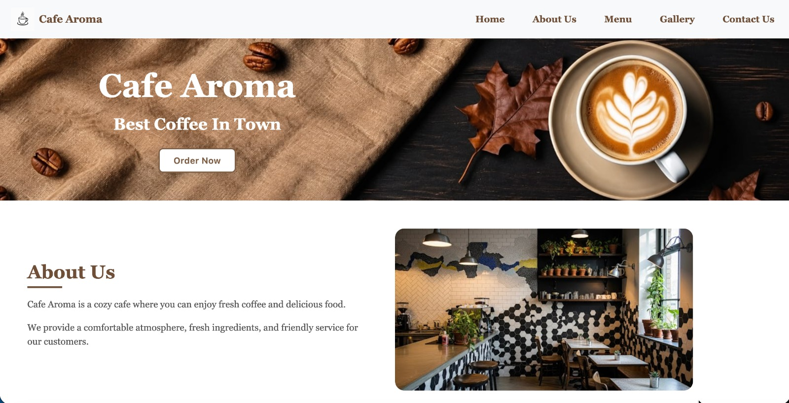
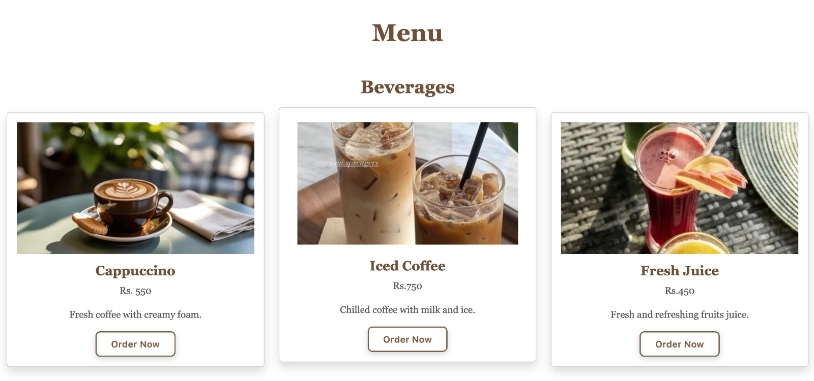
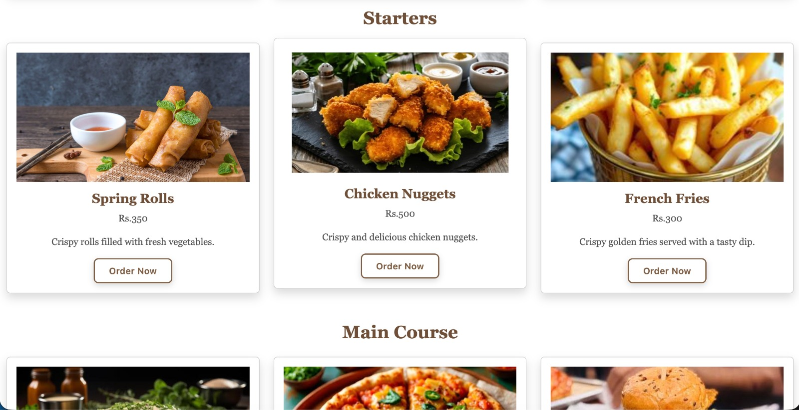
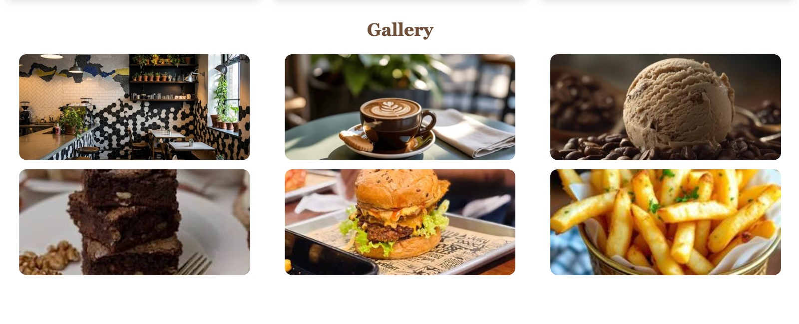
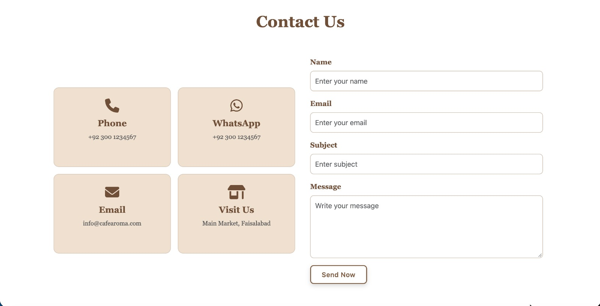
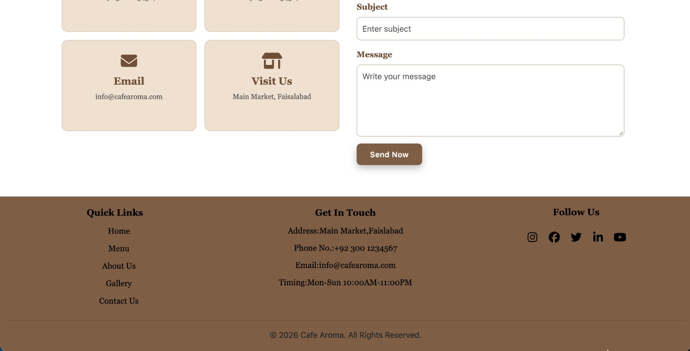

# Cafe Aroma ☕

A responsive static website for a fictional cafe, built with **HTML, CSS, and Bootstrap 5**. The site showcases the cafe's ambiance, menu, and gallery with a warm, coffee-inspired design.

## 🔗 Live Demo

https://cafe-aroma-six-navy.vercel.app/

## 📸 Screenshots

<table>
  <tr>
    <td align="center"><b>Home Page</b><br></td>
    <td align="center"><b>Menu Section</b><br></td>
  </tr>
  <tr>
    <td align="center"><b>Menu Section (cont.)</b><br></td>
    <td align="center"><b>Gallery Section</b><br></td>
  </tr>
  <tr>
    <td align="center"><b>Contact Section</b><br></td>
    <td align="center"><b>Footer</b><br></td>
  </tr>
</table>

 

## ✨ Features

* Fully responsive layout (mobile, tablet, desktop)
* Sticky/collapsible Bootstrap navbar with smooth scroll navigation
* Hero section with call-to-action
* About section with cafe description and image
* Menu section with categorized items (Beverages, Starters, Main Course) and pricing
* Image gallery
* Footer with social links and contact details

## 🛠️ Built With

* **HTML5** — page structure
* **CSS3** — custom styling (colors, typography, hover effects, animations)
* **Bootstrap 5.3.8** — responsive grid, navbar, and utility classes
* **Font Awesome 6.5.0** — social media icons

 
## 🚀 Getting Started

1. Clone the repository
   ```bash
   git clone https://github.com/liabafatima-2008/cafe-aroma
   ```
2. Open `index.html` in your browser — no build step or server required.

## 👤 Author

**Laiba Fatima**
Frontend Developer

* GitHub: https://github.com/liabafatima-2008
* LinkedIn: https://www.linkedin.com/in/laiba-fatima-7167a0430/

## 📄 License

This project is open source and available for personal or educational use.